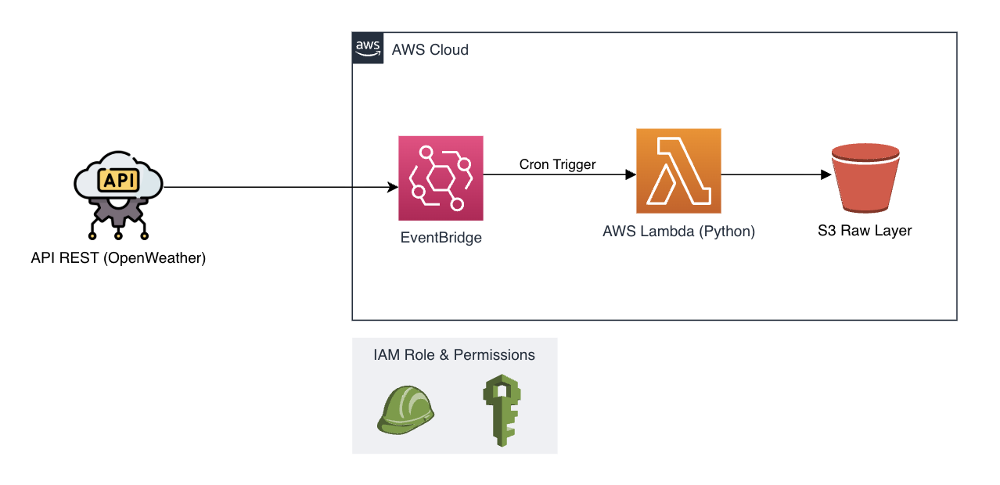

```markdown
# 🌦️ Serverless REST API Data Pipeline (AWS)

Uma pipeline de ingestão de dados totalmente *serverless* na AWS para extração, tratamento básico e carga (*EL*) de dados meteorológicos de uma API REST para a camada **Raw (Bronze)** de um Data Lake no Amazon S3.

## 📐 Arquitetura da Solução



---

## 🛠️ Tech Stack & Ferramentas

* **Linguagem:** Python 3.12 (boto3, requests)
* **Ambiente & Gerenciamento de Pacotes:** Poetry / Virtualenv (`.venv`)
* **Nuvem (AWS):**
* **AWS Lambda:** Execução efêmera do script de ingestão.
* **Amazon S3:** Armazenamento em nuvem para arquivos `.json` desnormalizados.
* **Amazon EventBridge:** Agendamento periódico (*Cron*) da pipeline.
* **AWS IAM:** Políticas de segurança no modelo *Least Privilege*.


* **Versionamento & CLI:** Git, AWS CLI, Linux Terminal.

---

## 🎯 Problema e Motivação de Engenharia

O objetivo fundamental deste projeto é construir uma ingestão resiliente de dados de fontes externas sem manter infraestrutura ligada 24/7.

Ao adotar uma arquitetura *Serverless*, reduzimos o custo operacional a zero em momentos de ociosidade, garantindo:

1. **Segurança:** Isolamento de chaves de API e credenciais do S3 por meio de variáveis de ambiente gerenciadas pela AWS e papéis do IAM.
2. **Escalabilidade:** Execução desacoplada capaz de processar respostas em milissegundos.
3. **Imutabilidade de Dados:** Armazenamento do payload original intacto na camada Raw com *timestamps*, permitindo reprocessamento histórico (*replay capability*).

---

## 📂 Estrutura do Repositório

```text
.
├── src/
│   └── lambda_function.py   # Lógica principal de ingestão e upload S3
├── package/                 # Diretório estagiado para empacotamento das dependências
├── pyproject.toml           # Configuração de dependências do Poetry
├── .gitignore               # Exclusão de artefatos de build e credenciais
└── README.md

```